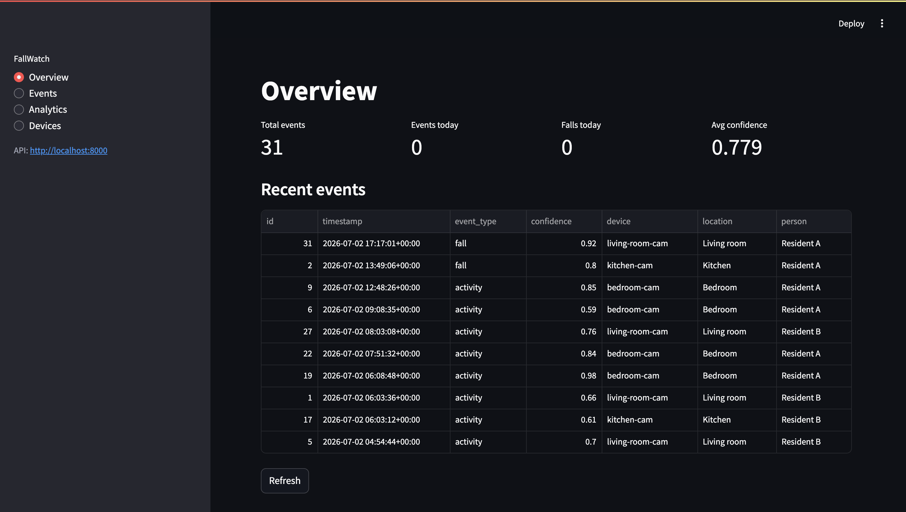
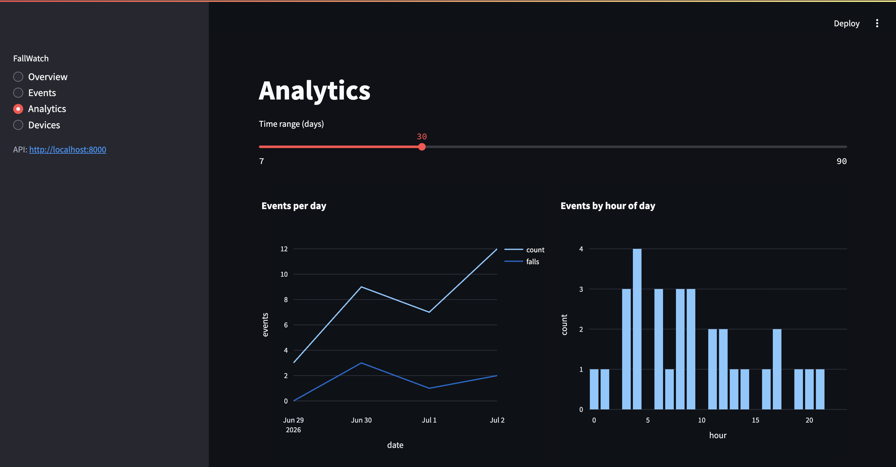
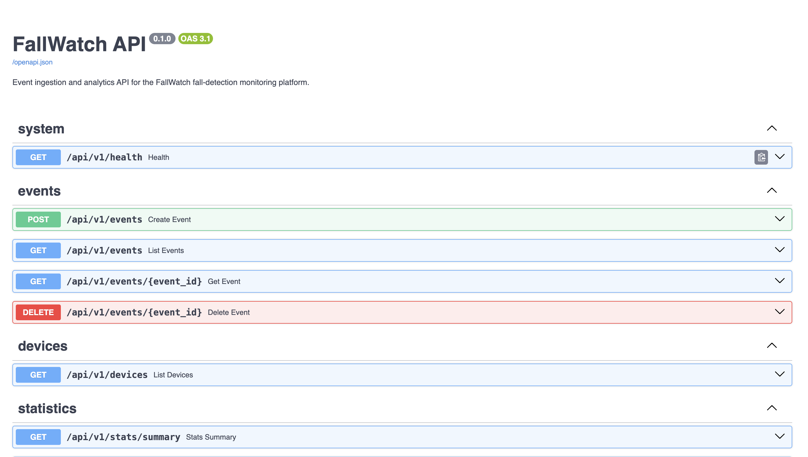

# FallWatch Platform

[](https://github.com/Ramandeep-AI/fallwatch-platform/actions/workflows/test.yml)

End-to-end monitoring platform built around a real-time AI fall detection
system: detection events flow from camera-side inference into a PostgreSQL
database via a REST API, and are surfaced through an analytics dashboard and
caregiver alerts.

Companion project: [ai-fall-detection-prototype](https://github.com/Ramandeep-AI/ai-fall-detection-prototype)
(the computer-vision model that produces the events).

## Architecture

```
Camera + detection model  →  FastAPI (REST)  →  PostgreSQL
                                   ↓
                     Streamlit dashboard · SMS/email alerts
```

| Component | Technology | Status |
|---|---|---|
| Database | PostgreSQL 16 (Docker), SQLAlchemy 2, Alembic migrations | ✅ |
| REST API | FastAPI + Pydantic, OpenAPI docs | ✅ events, devices, statistics |
| Tests & CI | pytest (in-memory DB) + GitHub Actions on every push | ✅ 12 tests |
| Dashboard | Streamlit + Plotly: metrics, filterable events, analytics, device health | ✅ |
| Alerts | SMS/email on fall events | planned |
| Deployment | AWS EC2 + RDS, Docker Compose | planned |

## Getting started

```bash
# 1. Python environment
python3 -m venv env && source env/bin/activate
pip install -r requirements.txt

# 2. Configuration
cp .env.example .env

# 3. Database (Docker)
docker compose up -d db

# 4. Apply migrations and seed sample data
alembic upgrade head
python -m backend.seed

# 5. Run the API
uvicorn backend.main:app --reload
```

Interactive API docs: http://localhost:8000/docs

```bash
# 6. Run the dashboard (in a second terminal, with the API running)
cd dashboard && streamlit run app.py
```

Dashboard: http://localhost:8501 — Overview metrics, filterable event
explorer, daily/hourly analytics charts, and device health.

## Screenshots

**Dashboard overview** — headline metrics and live event feed:



**Analytics** — daily trend, hour-of-day pattern, adjustable time range:



**Auto-generated API documentation** (OpenAPI/Swagger):



## Tests

```bash
pytest -v
```

Tests run against an in-memory SQLite database, so they need no Docker and
run in CI on every push.

## API overview

| Method | Path | Description |
|---|---|---|
| GET | `/api/v1/health` | liveness check |
| POST | `/api/v1/events` | ingest a detection event |
| GET | `/api/v1/events` | list events (pagination + filters: device, person, type, date range) |
| GET | `/api/v1/events/{id}` | single event with device/person details |
| DELETE | `/api/v1/events/{id}` | remove an event |
| GET | `/api/v1/devices` | list registered devices |
| GET | `/api/v1/stats/summary` | headline metrics (totals, today, avg confidence) |
| GET | `/api/v1/stats/daily` | events and falls per day |
| GET | `/api/v1/stats/hourly` | event counts by hour of day |

## Detection integration

`detection/api_client.py` provides `report_fall()`, called by the detection
process at the moment its alarm fires. The detection side runs wherever the
camera is; only event metadata crosses the network — no video leaves the
device.
