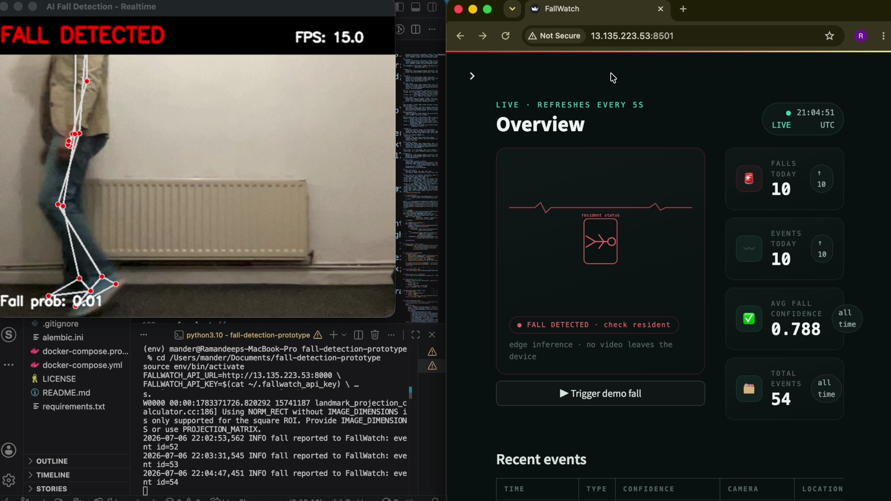
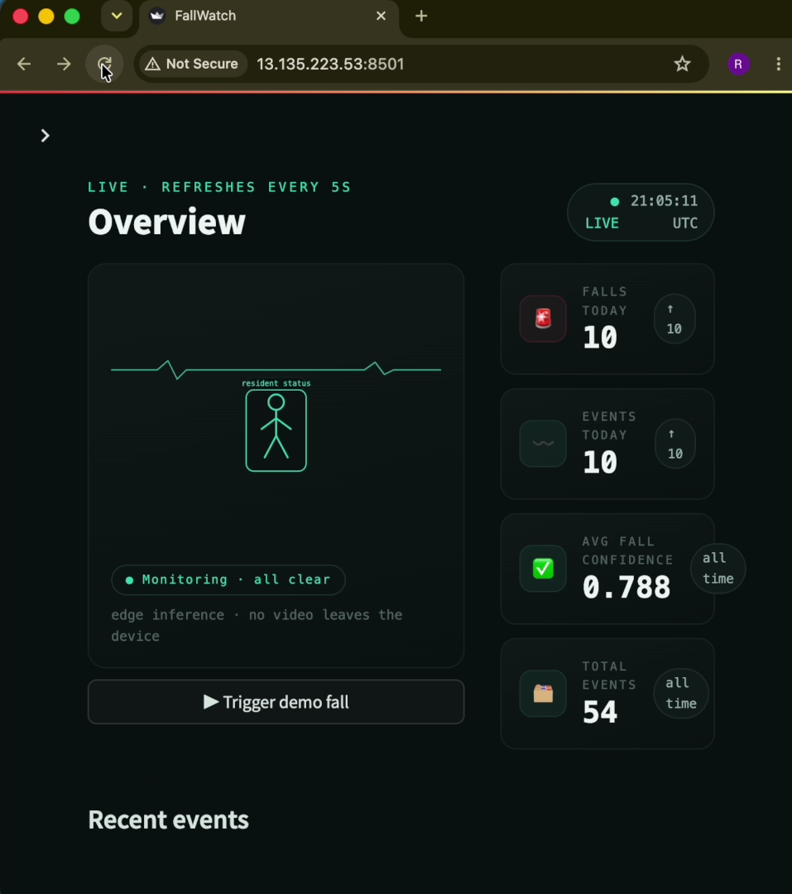

# FallWatch Platform

[](https://github.com/Ramandeep-AI/fallwatch-platform/actions/workflows/test.yml)

End-to-end monitoring platform built around a real-time AI fall detection
system: detection events flow from camera-side inference into a PostgreSQL
database via a REST API, and are surfaced through an analytics dashboard and
caregiver alerts.

Companion project: [ai-fall-detection-prototype](https://github.com/Ramandeep-AI/ai-fall-detection-prototype)
(the computer-vision model that produces the events).

## Live demo

[](https://youtu.be/b-rTquYopj0)

**[▶ Watch the 55-second unedited demo](https://youtu.be/b-rTquYopj0)** — a real
(controlled, onto a mattress) fall is detected by the edge model, reported over
the internet to this platform on AWS, raises an alert on the live dashboard
within seconds, and is acknowledged by the caregiver workflow.

**Try it live:** [dashboard](http://13.135.223.53:8501) · [API docs](http://13.135.223.53:8000/docs).
The demo is served over plain HTTP with synthetic, read-only data — browsers
will flag it "Not Secure", which is expected for a public demo carrying no
credentials or personal data. In production, TLS would terminate at a reverse
proxy (Caddy/Nginx + Let's Encrypt) behind a domain.

## Architecture

```
Camera + detection model  →  FastAPI (REST)  →  PostgreSQL
                                   ↓
              Streamlit dashboard · email alerts · Expo push
                                                       ↓
                                     FallWatch Mobile (caregiver app)
```

Mobile companion: [fallwatch-mobile](https://github.com/Ramandeep-AI/fallwatch-mobile)
(React Native/Expo caregiver app — live status board, one-tap alert
acknowledgement, push notifications).

| Component | Technology | Status |
|---|---|---|
| Database | PostgreSQL 16 (Docker), SQLAlchemy 2, Alembic migrations | ✅ |
| REST API | FastAPI + Pydantic, OpenAPI docs | ✅ events, devices, statistics |
| Tests & CI | pytest (in-memory DB) + GitHub Actions on every push | ✅ 23 tests |
| Dashboard | Streamlit + Plotly: metrics, filterable events, analytics, device health, alert management | ✅ |
| Alerts | Automatic on high-confidence falls; console, email and mobile push channels, acknowledge workflow | ✅ |
| Deployment | AWS EC2 + RDS (private), Docker Compose, Elastic IP | ✅ live |
| Security | API-key auth on writes, HTML-escaped rendering, non-root containers | ✅ |

## Getting started

```bash
# 1. Python environment
python3 -m venv env && source env/bin/activate
pip install -r requirements.txt

# 2. Configuration
cp .env.example .env

# 3. Database (Docker)
docker compose up -d db

# 4. Apply migrations and seed sample data
alembic upgrade head
python -m backend.seed

# 5. Run the API
uvicorn backend.main:app --reload
```

Interactive API docs: http://localhost:8000/docs

```bash
# 6. Run the dashboard (in a second terminal, with the API running)
streamlit run dashboard/app.py
```

Dashboard: http://localhost:8501 — Overview metrics, filterable event
explorer, daily/hourly analytics charts, and device health.

## Screenshots

**Dashboard overview** — live monitor panel, headline metrics, event feed
(auto-refreshes every 5 s; the panel turns red and the figure falls over
while an alert is open):


**Alerts** — caregiver acknowledgement workflow with response times:



**Auto-generated API documentation** (OpenAPI/Swagger):


## Tests

```bash
pytest -v
```

Tests run against an in-memory SQLite database, so they need no Docker and
run in CI on every push.

## API overview

| Method | Path | Description |
|---|---|---|
| GET | `/api/v1/health` | liveness check |
| POST | `/api/v1/events` | ingest a detection event |
| GET | `/api/v1/events` | list events (pagination + filters: device, person, type, date range) |
| GET | `/api/v1/events/{id}` | single event with device/person details |
| DELETE | `/api/v1/events/{id}` | remove an event |
| GET | `/api/v1/devices` | list registered devices |
| POST | `/api/v1/push-tokens` | register a mobile device for push alerts |
| GET | `/api/v1/stats/summary` | headline metrics (totals, today, avg confidence) |
| GET | `/api/v1/stats/daily` | events and falls per day |
| GET | `/api/v1/stats/hourly` | event counts by hour of day |
| GET | `/api/v1/alerts` | list alerts (filter by acknowledged state) |
| POST | `/api/v1/alerts/{id}/acknowledge` | mark an alert as handled |

## Security

Write endpoints (`POST /events`, `POST /alerts/{id}/acknowledge`,
`DELETE /events/{id}`) require an `X-API-Key` header when
`FALLWATCH_API_KEY` is configured; read endpoints stay public so the demo
dashboard and API docs remain browsable (all data shown is synthetic). The
database accepts connections only from the application server's security
group, secrets live in an uncommitted `.env`, all values rendered by the
dashboard are HTML-escaped, and the containers run as a non-root user.

## Alerts

Fall events at or above `ALERT_MIN_CONFIDENCE` (default 0.7) automatically
create alert records and dispatch notifications in a background task, so the
detection client never waits on delivery. Channels are pluggable: the console
channel is always active; configuring `SMTP_HOST` (see `.env.example`)
enables email; and mobile push activates automatically once a device running
[FallWatch Mobile](https://github.com/Ramandeep-AI/fallwatch-mobile) registers
its Expo push token via `POST /api/v1/push-tokens`. Caregivers acknowledge
alerts from the dashboard's Alerts page or from the mobile app.

## Detection integration

`detection/api_client.py` provides `report_fall()`, called by the detection
process at the moment its alarm fires. The detection side runs wherever the
camera is; only event metadata crosses the network — no video leaves the
device.
